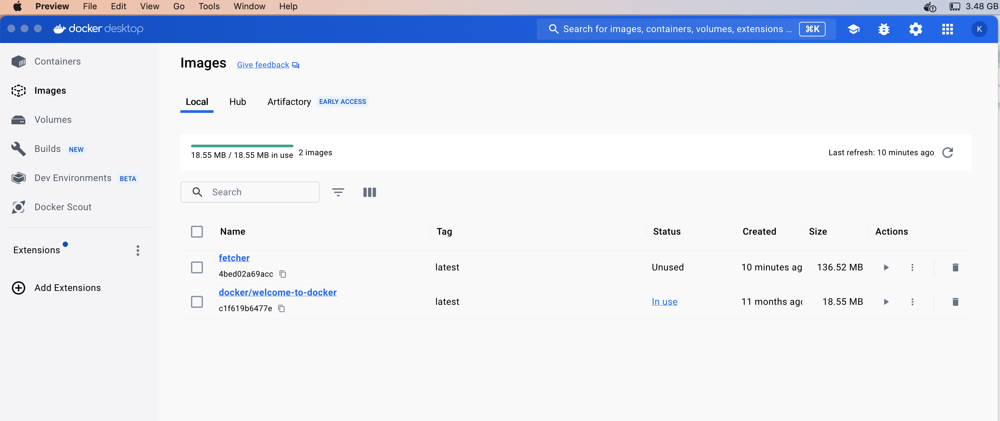
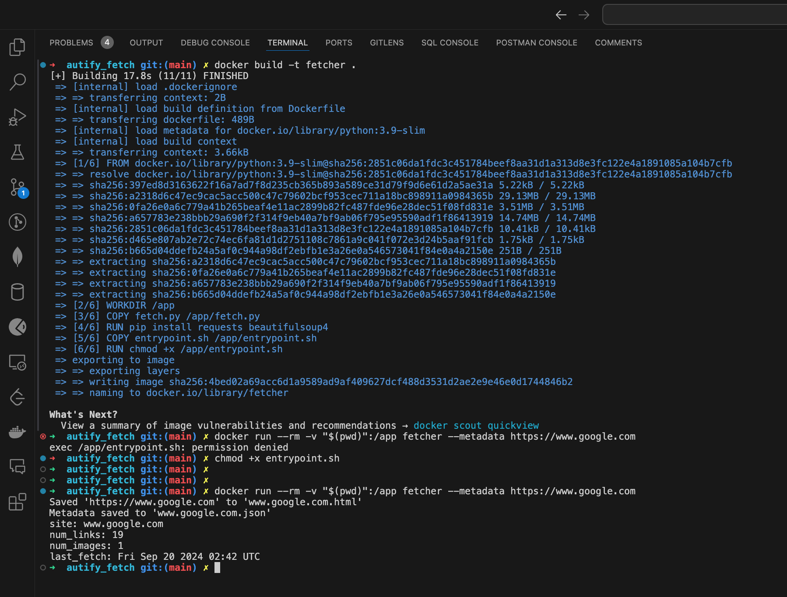

# Running with Docker

To simplify the setup and ensure consistency across different environments, you can run the application using Docker.

#### Prerequisites

- **Docker**: Ensure Docker is installed and running on your system.

#### Building the Docker Image

1. **Place the Following Files in the Same Directory**:

   - `fetch.py`
   - `Dockerfile`
   - `entrypoint.sh`

    **Make the Script Executable** (Optional)
   ```bash
   chmod +x entrypoint.sh
   ```

2. **Build the Docker Image**

   Open a terminal in the directory containing the files and run:

   ```bash
   docker build -t fetcher .
   ```

   This command builds a Docker image named `fetcher` based on the instructions in the `Dockerfile`.

#### Running the Application with Docker

To run the application using the Docker image, use the following command:

```bash
docker run --rm -v "$(pwd)":/app fetcher [options] [URLs]
```

- **Explanation**:
  - `--rm`: Automatically removes the container when it exits.
  - `-v "$(pwd)":/app`: Mounts the current directory into the container's `/app` directory, allowing the container to read and write files in your current directory.
  - `fetcher`: The name of the Docker image built earlier.
  - `[options] [URLs]`: Replace with any options (e.g., `--metadata`) and URLs you wish to fetch.

#### Examples

1. **Fetch a Single URL**

   ```bash
   docker run --rm -v "$(pwd)":/app fetcher https://www.example.com
   ```

2. **Fetch Multiple URLs with Metadata**

   ```bash
   docker run --rm -v "$(pwd)":/app fetcher --metadata https://www.example.com https://www.anotherexample.com
   ```

#### Notes

- **File Output**: The fetched site directories and files will be saved in your current directory on the host machine because of the volume mount (`-v "$(pwd)":/app`).

- **No Need to Install Dependencies Locally**: Since the application runs inside a Docker container, you don't need to have Python or the required libraries installed on your host system.

- **Updating the Script**: If you make changes to `fetch.py`, you need to rebuild the Docker image to include the changes:

  ```bash
  docker build -t fetcher .
  ```

#### Screenshots
Docker image built successfully


Docker run command
